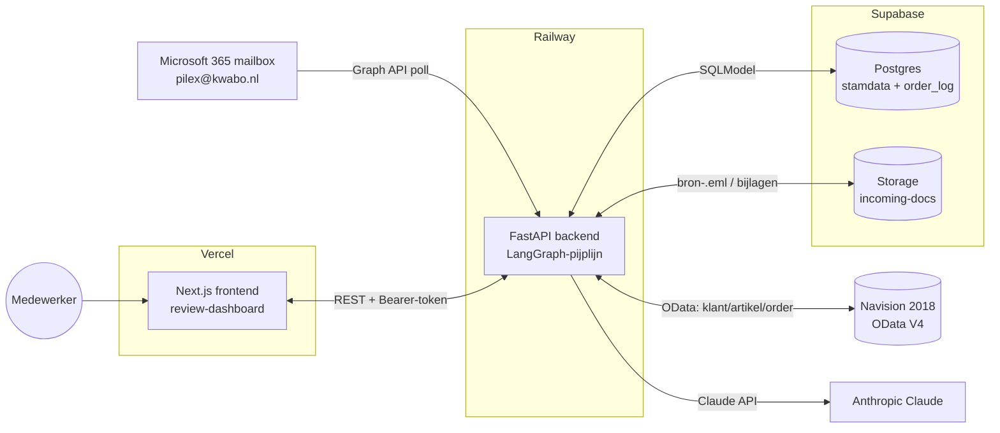
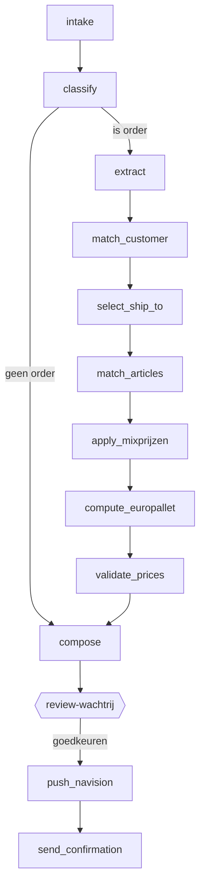

# Kwabo Order Intake AI — Architectuur & Werking

> Uitgebreide technische en functionele beschrijving van de Kwabo Order Intake-applicatie:
> wat de app doet, hoe hij is opgebouwd, hoe de data stroomt en hoe alles aan elkaar gekoppeld is.
>
> Laatst bijgewerkt: juni 2026. Productie draait vanaf branch `main`.

---

## 1. Overzicht & doel

Kwabo ontvangt bestellingen grotendeels per **e-mail** (in het Nederlands, Duits en Engels), vaak met
een **PDF-, Excel- of .msg-bijlage**. Het handmatig overtypen van die bestellingen in Navision (NAV) is
tijdrovend en foutgevoelig.

De **Kwabo Order Intake AI** automatiseert dat: hij leest binnenkomende order-mails, begrijpt met behulp
van een taalmodel (Claude) wát er besteld wordt, matcht klant en artikelen tegen de NAV-stamdata, en
bouwt een **concept-verkooporder** op die een medewerker in een webdashboard controleert en met één klik
naar Navision pusht.

### Het kernprincipe: velden invullen, niet platte tekst

De belangrijkste ontwerp-eis: de tool moet NAV op dezelfde manier voeden als een mens dat in het scherm
zou doen — **veld voor veld**. Navision heeft achter vrijwel elk veld `OnValidate`/`OnInsert`-triggers
en codeunits die automatisch vervolgvelden invullen (prijs, omschrijving, korting, adres, mix-prijs…).
Daarom:

- De tool stuurt **nooit** platte tekst of een kant-en-klare regel met alle velden tegelijk.
- De tool berekent **zelf geen prijzen** — dat doet NAV. De tool kiest alleen de juiste **artikel- en
  eenheidscode**, en NAV prijst de regel zelf via zijn eigen verkoopsoort-cascade.
- Elke handeling is een **enkel-veld** POST of PATCH, zodat de bijbehorende NAV-trigger vuurt.

### Mens-in-de-lus

De AI beslist niet autonoom. Elke order belandt eerst in een **review-wachtrij**. Een medewerker ziet de
geëxtraheerde gegevens, de matches, en een **live preview van exact de NAV-operaties** die uitgevoerd
gaan worden. Pas na goedkeuring wordt de order daadwerkelijk naar NAV gepusht. Goedkeuringen voeden
bovendien twee **self-learning loops** (zie §9), waardoor de tool met de tijd beter matcht.

---

## 2. High-level architectuur



| Laag | Technologie | Host | Rol |
|------|-------------|------|-----|
| Mailbox | Microsoft 365 / Graph API | Microsoft | Bron van order-mails + bijlagen |
| Backend | Python, FastAPI, LangGraph, SQLModel | **Railway** (`kwabo-production.up.railway.app`) | Pijplijn, NAV-integratie, API |
| Database | Postgres | **Supabase** | Stamdata-mirror + verwerkte orders |
| Bestandsopslag | Object storage (bucket `incoming-docs`) | **Supabase Storage** | Bron-.eml + bijlagen |
| Taalmodel | Claude Sonnet 4.5 | **Anthropic API** | Classificatie + extractie |
| Frontend | Next.js 16, React 19, Tailwind 4 | **Vercel** (`kwabo-pilex.vercel.app`) | Review-dashboard |
| ERP | Microsoft Dynamics NAV 2018 | On-prem/cloud OData | Doelsysteem (verkooporders) |

**Deploy-model:** zowel backend (Railway) als frontend (Vercel) deployen automatisch vanaf de
`main`-branch in GitHub. `/api/version` geeft de live commit-SHA terug; `/api/health` is de liveness-check.

---

## 3. Tech-stack

**Backend**
- **Python** met **FastAPI** (ASGI via Uvicorn).
- **LangGraph** voor de verwerkingspijplijn (een state-graph van "nodes").
- **SQLModel** (Pydantic + SQLAlchemy) als ORM op **Postgres** (prod) / **SQLite** (lokaal/dev).
- **Anthropic SDK** + **langchain-anthropic** voor de LLM-aanroepen.
- **httpx** voor de NAV OData-client en Microsoft Graph.
- **pdfplumber / openpyxl / extract-msg** voor bijlage-parsing.

**Frontend**
- **Next.js 16** (App Router) + **React 19** + **Tailwind CSS 4**.
- **sonner** voor toasts. Auth via cookie + middleware.

**Infra**
- **Railway** (backend), **Vercel** (frontend), **Supabase** (Postgres + object storage).
- **Claude Sonnet 4.5** (`claude-sonnet-4-5`) als standaardmodel (configureerbaar).

---

## 4. De verwerkingspijplijn (LangGraph)

De kern is een LangGraph **state-graph**. Eén gedeeld `OrderState`-object (een dict/TypedDict) wordt door
de opeenvolgende nodes verrijkt. Er zijn **drie** graphs (`backend/src/kwabo/graph/graph.py`):

1. **`ingest_graph`** — de hoofdpijplijn voor een binnenkomende e-mail.
2. **`sub_order_graph`** — voor extra orders die het LLM als losse orders in één mail herkent
   (multi-order). Start direct bij `match_customer` (intake/classify/extract zijn al gedaan).
3. **`finalize_graph`** — draait **ná** menselijke goedkeuring: `push_navision → send_confirmation`.

### 4.1 Volgorde van de hoofdpijplijn



`classify` heeft een **conditionele edge** (`_route_after_classify`): is het een order → `extract`;
is het geen order (spam/overig) → direct `compose` (zodat het netjes als "geen order" wordt vastgelegd).

### 4.2 De nodes

| Node | Wat het doet | Raakt |
|------|--------------|-------|
| **intake** | Logt ontvangst, telt bijlagen. Pure audit-stap. | — |
| **classify** | Vraagt Claude of de mail een order is (vs. spam/overig). JSON-output `{is_order, reden, confidence}`. | LLM |
| **extract** | Vraagt Claude (incl. **Vision** voor PDF) alle ordergegevens te extraheren: klant-hints, bestelnummer, datums, afleveradres, **orderregels**, opmerkingen — mét **provenance** per veld (waar komt de waarde vandaan + confidence). Verwerkt Duitse "KW 24"-weeknummers en multi-order-arrays. | LLM (Vision) |
| **match_customer** | Koppelt de afzender aan een NAV-klantnummer. Strategie: DB op e-mail → forward-detectie → NAV-zoek op e-mail → NAV-zoek op domein/naam. Bij meerdere kandidaten scoren op afleveradres (postcode/plaats/straat). | DB + NAV |
| **select_ship_to** | Kiest het juiste verzendadres uit de gesyncte ship-to-adressen van de klant; scoort tegen het afleveradres uit de mail. 1 kandidaat → automatisch; ≥2 → review. | DB |
| **match_articles** | Per regel: klant-SKU → Kwabo-artikel. Cascade: **exact** Kwabo-nr → **kruisverwijzing** (NAV tabel 5717) → **klantenkaart-mapping** → **history** (geleerd) → **fuzzy** op omschrijving → handmatig. Valideert daarna de eenheid tegen de toegestane item-eenheden. | DB + NAV |
| **apply_mixprijzen** | Alleen voor mix-klanten: kiest de juiste mix-eenheidscode (zie §8) en zet de hoeveelheid om naar pallets. | DB |
| **compute_europallet** | Bepaalt of er een europallet-regel (artikel `19820`) bij moet, en met hoeveel. Gebruikt geleerde pallet-kennis + heuristiek (zie §9). | DB |
| **validate_prices** | Sanity-checks op hoeveelheden/eenheden en vergelijkt geëxtraheerde prijs met prijsafspraken (informatief — NAV blijft prijs-autoriteit). | DB |
| **compose** | Bouwt de chronologische lijst NAV-operaties (`nav_operations`) via een **pure functie** en persisteert de order in `order_log` met status `review`. | DB |
| **push_navision** | Voert `nav_operations` stap-voor-stap uit tegen NAV; stopt bij de eerste fout; legt resultaten + autofill vast. | NAV |
| **send_confirmation** | Stuurt (optioneel) een bevestigingsmail. Bij `MAIL_MODE=log` wordt alleen gelogd. | Mail |

### 4.3 OrderState — de belangrijkste velden

`backend/src/kwabo/graph/state.py` definieert `OrderState` en `OrderRegel`.

- **Invoer:** `email_id`, `email_from`, `email_subject`, `email_body`, `email_date`, `bijlagen[]`.
- **Classificatie:** `is_order`, `classificatie_reden`, `classificatie_confidence`.
- **Extractie:** `taal`, `bestelnummer_klant`, `orderdatum`, `gewenste_leverdatum`, `afleveradres`,
  `afleverinstructies`, `orderregels[]`, `opmerkingen`, `_meta` (provenance per veld).
- **OrderRegel:** `positie`, `artikelnummer_klant`, `artikelnummer_kwabo`,
  `artikelnummer_kwabo_matched`, `omschrijving`, `hoeveelheid`, `eenheid`, `eenheid_origineel`,
  `eenheid_default`, `prijs_per_eenheid`, `match_confidence`, `match_methode`,
  `mix_uom_kandidaat`, `mix_uom_gekozen`, `mix_aantal`.
- **Matching/keuzes:** `klant_match` (`navision_klantnr`, `klantnaam`, confidence, bron),
  `ship_to_kandidaten`, `ship_to_gekozen`.
- **Mix/pallet:** `mixprijzen_actief`, `order_mix_total_pallets`, `europallet_regel`.
- **NAV:** `nav_operations`, `nav_operation_results`, `nav_autofilled`, `navision_order_nr`,
  `incoming_document_path` / `_storage_key`.
- **Review:** `needs_review_fields`, `needs_review_count`, `review_status`, `reviewer`.
- **Persistentie/multi-order:** `order_log_id`, `extra_orders_raw`, `parent_log_id`, `sub_order_index`.

---

## 5. E-mail-intake

Twee modi (`EMAIL_MODE`): `graph` (Microsoft Graph, productie) en `file_drop` (lokale inbox-map, dev).

- **Poller:** bij opstart start de FastAPI-lifespan een achtergrond-loop (`MAIL_POLL_INTERVAL_SECONDS`,
  in productie ~300 s) die periodiek `/api/intake/scan` aanroept. Een **multi-worker-guard** zorgt dat
  alleen één worker pollt (geen dubbele Graph-calls).
- **Graph-client:** haalt ongelezen berichten uit de inbox, downloadt de ruwe RFC822-mail, parseert body
  + bijlagen. OAuth-tokens staan in de DB en worden automatisch ververst.
- **Bijlagen:** PDF (naar tekst + base64 voor Claude Vision), Excel/CSV (tekst), `.msg` (Outlook),
  platte tekst. De **bron-.eml** + bijlagen worden opgeslagen in Supabase Storage (bucket
  `incoming-docs`) onder een botsings-vrije sleutel; lokaal is er een schijf-fallback.
- **Poison-pill-guard:** een mail die 3× achter elkaar crasht, wordt als "gezien" gemarkeerd en
  gealarmeerd, zodat de poller niet eindeloop in dezelfde fout blijft hangen.
- Per scan geldt een wandklok-budget (~240 s) zodat de Railway-proxy niet timeoutt.

---

## 6. LLM-gebruik

- **Provider/model:** Anthropic **Claude Sonnet 4.5** (`ANTHROPIC_MODEL`, default `claude-sonnet-4-5`).
- **classify** gebruikt de LangChain-wrapper; **extract** gebruikt de Anthropic-SDK direct met
  **document-blocks** (PDF base64) zodat Claude de bijlage "ziet" (Vision).
- **Provenance:** extract levert per veld `{value, source, source_detail, confidence, needs_review}`,
  zodat het dashboard kan tonen wáár elke waarde vandaan komt en wat onzeker is.
- **Tolerante JSON-parsing:** de LLM-output wordt met een vergevingsgezinde parser gelezen (`parse_json_loose`).
- **Caching:** een file-based content-addressable cache (`LLM_CACHE_MODE` = `on`/`read-only`/`off`),
  sleutel = SHA256 van model + prompts. Bespaart kosten/latentie bij herverwerking.

---

## 7. Navision-integratie

Bestanden: `integrations/navision_nav2018.py` (echte client), `navision_steps.py` (compose, pure functie),
`nav_operations.py` (invarianten), `navision_api.py` (factory + mock).

- **Modus** (`NAVISION_MODE`): `nav2018` (echt) of `mock` (in-memory voor tests/demo).
- **OData-vorm:** `…/ODataV4/Company('{company}')/PLX_<Page>`; HTTP Basic-auth met een
  web-service-sleutel. Company in productie: *"Kopie 2026 Kwabo Techniek B.V."*.
- **Trigger-aware stepwise order** (zie §1): de composer bouwt een chronologische lijst van enkel-veld
  operaties:
  1. `POST /salesOrders` met **alleen** `{customerNumber}` → NAV vult sell-to-gegevens.
  2. `PATCH shipToCode` (best-effort), `externalDocumentNumber`, `requestedDeliveryDate`,
     `shipmentDate` (eerstvolgende werkdag) — elk één veld.
  3. Per regel: `POST` regel met `{lineType, itemNumber}` → NAV vult omschrijving/prijs;
     daarna `PATCH unitOfMeasureCode` en `PATCH quantity` (elk één veld).
  4. Europallet-regel idem.
  5. Inkomend document (zie §16).
- **Invarianten** (`_assert_op_invariants`): order-POST heeft exact 1 veld; regel-POST exact 2;
  elke PATCH exact 1 veld. Zo blijft elke trigger gegarandeerd vuren. Er wordt **nooit** een prijs
  meegestuurd.
- **Idempotentie:** dedup op `External_Document_No` — bestaat de order al, dan wordt niet dubbel gepusht.
- **Ship-to is best-effort:** weigert NAV de ship-to-code, dan blijft de order geldig (sell-to-adres) en
  krijgt de reviewer een waarschuwing i.p.v. een harde fout.
- **Gebruikte PLX_-pages:** `PLX_SalesOrder`, `PLX_Customer`, `PLX_Item`, `PLX_ItemReference`,
  `PLX_ShipToAddress`, `PLX_ItemUnitOfMeasure`.
- **Mock-client:** simuleert OnValidate-triggers en autofill, voor tests en de demo-branch.

---

## 8. Mixprijzen

Sommige klanten hebben **mixprijzen**: de prijs hangt af van het totaal aantal pallets over meerdere
artikelregels samen, via een staffel. De tool berekent de prijs niet — hij kiest alleen de juiste
**mix-eenheidscode**, en NAV prijst.

- **Klant-vlag:** `Klantenkaart.mixprijzen`, gesynct uit NAV-veld `Mix_Prices_Allowed` (PLX_Customer).
- **Mix-codes:** staan al in `PLX_ItemUnitOfMeasure` (gesynct naar `ArtikelEenheid`) in het formaat
  **`M{totaal_pallets}PAL{eenheden_per_pallet}`** (bv. `M7PAL30`, `M33PAL35`).
- **Staffel:** het `M`-getal is order-breed (totaal aantal pallets over alle mixregels). Per artikel
  wordt de hoogste tier ≤ dat totaal gekozen (clamp naar de laagste tier als het totaal eronder ligt).
- **Autoritatieve eenheden-per-pallet:** `ArtikelEenheid.qty_per_base` (= NAV
  `Qty_per_Unit_of_Measure`), **niet** het `PALxx`-suffix — dat suffix is een handmatig label dat
  typfouten kan bevatten (bv. item 15450: `M5PAL528` terwijl de echte waarde 1728 is). De hoeveelheid
  wordt omgerekend naar pallets via `qty_per_base`; de **letterlijke** code wordt naar NAV gestuurd.
- **Voorwaarde "klant én artikel mix":** geborgd doordat de node alleen mix toepast als de klant
  mix-vlag heeft **én** het artikel mix-codes in `ArtikelEenheid` heeft (alleen mix-artikelen hebben die).

---

## 9. Europallet & de twee self-learning loops

### 9.1 Europallet (artikel 19820)
`compute_europallet` telt per regel de pallet-bijdrage op en voegt een europallet-regel toe als het
totaal een drempel haalt. Bijdrage-bronnen, in volgorde: (1) **geleerde pallet-kennis**, (2) item-UOM-
conversie (`qty_per_base`), (3) heuristiek (PAL telt 1:1, DOOS ≈ 1 pallet per 24, mix-regels tellen hun
`mix_aantal` pallets). De europallet-regel wordt apart bewaard (`europallet_regel`), niet in `orderregels`.

### 9.2 Loop A — artikel-match learning
Bij goedkeuring schrijft `_learn_from_approved` voor elke regel met zowel een klant-SKU als een
gematcht Kwabo-artikel een mapping naar **`klantenkaart_artikelen`** + een rij in
**`artikel_matching_history`**. De volgende keer dat dezelfde klant-SKU binnenkomt, matcht
`match_articles` die via **klantenkaart** (conf. 0,9) of **history** (frequentst, conf. 0,95) — vóór
fuzzy. Zo wordt fuzzy-matching met de tijd vervangen door zekere matches.

### 9.3 Loop B — europallet pallet-kennis
Bij goedkeuring schrijft `_persist_pallet_feedback` per bijdragende `(artikel, eenheid)` een rij in
**`artikel_pallet_kennis`**: `pallet_required = ja` als de reviewer de europallet liet staan, `nee` als
hij hem verwijderde terwijl de heuristiek er wél één zou toevoegen. `compute_europallet` laat die
geleerde kennis vervolgens de heuristiek overrulen.

Beide loops zijn end-to-end getest (goedkeuren → fact geleerd → volgende order gebruikt het) en in
productie aantoonbaar actief (klanten hebben al geleerde mappings).

---

## 10. Datamodel

Alle tabellen in `backend/src/kwabo/db/models.py` (SQLModel). Geen formele foreign keys; koppeling
gebeurt logisch op **`nav_klantnr`** (klant) en **`kwabo_artikelnr`** (artikel).

### 10.1 Tabellen

| Tabel | Sleutel | Doel |
|-------|---------|------|
| **klantenkaarten** (`Klantenkaart`) | `id`; uniek `nav_klantnr` | Klant-mirror uit NAV: naam, e-mail(s), taal, krediet, **mixprijzen**. |
| **klant_email_aliases** | `id` | Extra e-mailadressen per klant (routing van order-mails). |
| **klantenkaart_ship_to** | (`klant_nr`,`ship_to_code`) | Verzendadressen per klant (NAV tabel 222). |
| **klantenkaart_artikelen** | `id` | Klant-SKU → Kwabo-artikel mapping (geleerd/handmatig). |
| **artikel_kruisverwijzing** | (`klant_nr`,`klant_artikelnr`) | NAV item-cross-reference (tabel 5717). |
| **artikel_matching_history** | `id` | Logboek van alle match-beslissingen → basis voor `best_history`. |
| **artikelkaarten** (`Artikelkaart`) | `kwabo_artikelnr` | Artikel-mirror: naam, basis-eenheid, mixprijzen, palletable. |
| **artikel_eenheden** (`ArtikelEenheid`) | (`kwabo_artikelnr`,`eenheid_code`) | Eenheden per artikel (NAV 5404): `qty_per_base`, `is_mix_uom`, mix-codes. |
| **artikel_pallet_kennis** | (`kwabo_artikelnr`,`eenheid`) | Self-learning: pallet ja/nee + `per_pallet` + confidence. |
| **prijsafspraken** (`Prijsafspraak`) | `id` | Prijsafspraak per klant/artikel/type (standaard/mix/pallet/topcoat). |
| **klant_documenten** (`KlantDocument`) | `id` | Geüploade klant-documenten + geëxtraheerde tekst. |
| **oauth_config / oauth_tokens** | `id=1` (singleton) | Microsoft Graph OAuth-config + tokens. |
| **order_log** (`OrderLog`) | `id`; index `email_id`,`status` | **Centrale order-tabel**: status, klant, matches, en de **volledige pipeline-state als `order_state` JSON** + `stappen_log`. |

### 10.2 Hoe alles gelinkt is

```
nav_klantnr  ─┬─ klantenkaarten (1 klant)
              ├─ klant_email_aliases      (1→n e-mails)
              ├─ klantenkaart_ship_to     (1→n adressen)
              ├─ klantenkaart_artikelen   (1→n SKU-mappings)      ─→ kwabo_artikelnr
              ├─ artikel_kruisverwijzing  (1→n cross-refs)        ─→ kwabo_artikelnr
              ├─ artikel_matching_history (1→n match-events)      ─→ kwabo_artikelnr
              ├─ prijsafspraken           (1→n prijzen)           ─→ kwabo_artikelnr
              └─ order_log.klant_nr       (1→n orders)

kwabo_artikelnr ─┬─ artikelkaarten (1 artikel)
                 ├─ artikel_eenheden      (1→n eenheden, incl. mix-codes)
                 └─ artikel_pallet_kennis (1→n eenheid-kennis)

order_log.order_state (JSON)  ─→ bevat de volledige OrderState incl. orderregels,
                                  klant_match, ship_to, mix/pallet, nav_operations.
```

`order_log` is het hart van de verwerking: één rij per binnengekomen mail (en per sub-order), met de hele
toestand als JSON-blob zodat het dashboard de order kan tonen, bewerken (patch-field) en finaliseren.

---

## 11. Repositories, sessie & migraties

`backend/src/kwabo/db/repository.py` bevat dunne repo-klassen rond de modellen:

- **KlantRepo** — `by_email`, `by_nav_nr`, `all`, alias-beheer, `upsert` (behoudt door gebruiker
  bewerkte velden).
- **ArtikelRepo** — `mapping`, `upsert_mapping`, `best_history` (frequentst geleerde match), `add_history`.
- **ArtikelkaartRepo** — `get`, `upsert`, `list_eenheden`, `valid_uom_codes`, `list_with_mixprijzen`.
- **KruisverwijzingRepo / ShipToRepo / PalletKennisRepo** — `lookup` + `upsert` op hun composite keys.
- **PrijsRepo** — `best_match` (cascade pallet→mix→topcoat→standaard).
- **OrderLogRepo** — `create`, `get`, `by_email`, `list_by_status` (defert grote JSON-velden), `update`.

**Sessie/migraties** (`db/session.py`): `init_db()` draait `SQLModel.metadata.create_all` (nieuwe
tabellen) + `_apply_additive_migrations()` — een idempotente shim die **nieuwe kolommen op bestaande
tabellen** toevoegt (bv. `klantenkaarten.mixprijzen`), omdat `create_all` dat niet doet. Voor Postgres
gebruikt de engine een connection-pool met `pool_pre_ping` (pgbouncer-vriendelijk).

---

## 12. Master-data-sync (NAV → DB)

Endpoint: `POST /api/admin/nav-sync?domains=…&dry_run=…` (achtergrond-job, pollen via
`GET /api/admin/nav-sync/{job_id}`). Domeinen en hun mapping:

| Domein | NAV-page | DB-tabel |
|--------|----------|----------|
| `customers` | PLX_Customer (18) | klantenkaarten (incl. `Mix_Prices_Allowed`, `Customer_Price_Group`) |
| `items` | PLX_Item (27) | artikelkaarten |
| `cross_ref` | PLX_ItemReference (5717) | artikel_kruisverwijzing |
| `ship_to` | PLX_ShipToAddress (222) | klantenkaart_ship_to |
| `item_uoms` | PLX_ItemUnitOfMeasure (5404) | artikel_eenheden (incl. mix-codes + `qty_per_base`) |

Belangrijke patronen: veldnaam-tolerante mappers (`_*_to_record`), **bulk delete+insert via
`asyncio.to_thread`** voor de grote `item_uoms`-sync (~13k rijen) zodat de event-loop en `/api/health`
responsief blijven (twee eerdere outages kwamen door per-rij blocking writes), `dry_run` met
`sample_keys` om live de echte NAV-veldnamen te inspecteren, en `db_counts` voor verificatie.

---

## 13. Frontend (Vercel)

Next.js 16 App Router. Belangrijkste pagina's:

| Route | Doel |
|-------|------|
| `/` | **Order-wachtrij**: alle orders met statusfilters (review/gepusht/geen order/alle) + telstatistieken. |
| `/login` | Wachtwoord-login (zet de sessie-cookie). |
| `/orders/[id]` | **Order-review** (3-koloms): e-mail/bijlagen · extract+klantkaart+regels · NAV-preview. |
| `/klanten` + `/klanten/[nr]` | Klantenlijst + detail (mappings, prijsafspraken, aliassen, documenten). |
| `/email` | Mailbox/OAuth-configuratie + status. |
| `/audit` | Audit-log van alle AI-beslissingen + statistieken. |
| `/logs` | Live backend-logs (SSE-stream). |

**Order-review-flow:** elk veld is een `FieldInput` met provenance-badge die bij wijziging
`api.patchField(orderId, "<pad>", waarde)` aanroept (`PATCH /api/orders/{id}/patch-field`). Speciale
reviewer-controls: **ShipToPicker** (verzendadres), **MixprijzenBadge** (mix-eenheid kiezen),
**EuropalletEditor** (europallet toevoegen/aanpassen/verwijderen), en **NavOperationsPreview** die
exact de POST/PATCH-operaties toont die NAV gaat krijgen. Goedkeuren → `POST /api/orders/{id}/approve`
(start de `finalize_graph` + voedt de learning-loops); afwijzen → `/reject`.

**API-client & auth** (`frontend/lib/api.ts`): `API_BASE = process.env.NEXT_PUBLIC_API_BASE`
(Railway-URL in productie). Login gaat via een Vercel-route die het backend-token in een cookie
(`kwabo_admin`) zet; `middleware.ts` stuurt niet-ingelogde gebruikers naar `/login`. Elk verzoek krijgt
`Authorization: Bearer <token>`.

> Let op (zie `frontend/AGENTS.md`): dit is **Next.js 16** met breaking changes — raadpleeg
> `node_modules/next/dist/docs/` vóór frontend-wijzigingen.

---

## 14. Configuratie & deployment

Belangrijkste env-vars (`backend/src/kwabo/config.py`):

- **NAV:** `NAVISION_MODE`, `NAV_BASE_URL`, `NAV_COMPANY`, `NAV_USERNAME`, `NAV_PASSWORD`,
  `NAV_PAGE_*`, `NAV_VERIFY_SSL`.
- **LLM:** `ANTHROPIC_API_KEY`, `ANTHROPIC_MODEL`, `LLM_CACHE_MODE`.
- **Data/opslag:** `DATABASE_URL`, `SUPABASE_URL`, `SUPABASE_SERVICE_ROLE_KEY`,
  `SUPABASE_BUCKET_INCOMING_DOCS`.
- **Mail:** `EMAIL_MODE`, `MAIL_MODE` (`log`/`smtp`/`graph`), `MAIL_POLL_INTERVAL_SECONDS`.
- **Auth:** `ADMIN_PASSWORD`, `JWT_SECRET`, `JWT_TTL_HOURS`, `SIGNED_URL_*`.
- **Overig:** `EUROPALLET_ARTIKELNR` (default `19820`), `FRONTEND_URL`, `LOG_LEVEL`.

**Deployment:** Railway draait `uvicorn kwabo.main:app` (start vanaf `main`, healthcheck `/api/health`,
`restartPolicy=ALWAYS`). Vercel bouwt de frontend vanaf `main`. Diagnostiek (auth-gated):
`/api/version`, `/api/diagnostics/config`, `/api/diagnostics/nav`, `/api/diagnostics/nav/services`,
`/api/diagnostics/nav/raw`.

---

## 15. End-to-end datastroom (voorbeeld)

1. Klant mailt een bestelling (met PDF) naar `pilex@kwabo.nl`.
2. De poller haalt de mail op, slaat de bron-.eml op in Supabase Storage, en start de `ingest_graph`.
3. **classify** → order; **extract** → Claude leest mail + PDF en levert klant-hints, regels en
   provenance.
4. **match_customer** koppelt de afzender aan bv. klant `60203` (Veris); **select_ship_to** kiest het
   adres; **match_articles** matcht elke regel (exact/kruisverwijzing/klantenkaart/history/fuzzy).
5. **apply_mixprijzen** (als mix-klant) kiest mix-eenheden + pallet-aantallen; **compute_europallet**
   voegt evt. een palletregel toe; **validate_prices** doet sanity-checks.
6. **compose** bouwt de NAV-operatielijst en zet de order op status `review` in `order_log`.
7. De medewerker opent de order in het dashboard, controleert/bewerkt velden (elk een `patch-field`),
   ziet de live NAV-preview en klikt **Goedkeuren & Push**.
8. **push_navision** voert de enkel-veld POST/PATCH-operaties stap-voor-stap uit; NAV's triggers vullen
   prijs/omschrijving/adres in. Status wordt `pushed` met het NAV-ordernummer.
9. De goedkeuring **voedt de learning-loops**: klant-SKU→Kwabo-mappings en pallet-kennis worden
   weggeschreven, zodat de volgende identieke order automatisch beter matcht.

---

## 16. Bekende beperkingen / openstaand

- **Inkomend document koppelen** (bron-.eml als "incoming document" aan de NAV-order): de nav2018-client
  **slaat dit bewust over** omdat er geen `PLX_IncomingDocument`-OData-page is gepubliceerd. Header +
  regels worden wél gepusht; de reviewer krijgt een waarschuwing om het document handmatig te koppelen.
  Actie ligt bij NAV-beheer (page publiceren).
- **Verkoopprijzen (NAV tabel 7002) als beslissteun** bij twijfel over artikelkeuze: niet gebouwd
  (optioneel; 7002 is niet via OData beschikbaar). NAV blijft sowieso de prijs-autoriteit.
- **Mixprijs-calibratie:** de aanname "NAV prijst de mix-regel zelf zodra wij de mix-eenheid PATCHen" is
  pas 100% te bevestigen met één échte order door de UI; code, deploy en data zijn geverifieerd.

---

## Bestandsverwijzingen (snelle index)

- Pijplijn: `backend/src/kwabo/graph/graph.py`, `state.py`, `nodes/*.py`
- NAV: `backend/src/kwabo/integrations/navision_nav2018.py`, `navision_steps.py`, `navision_api.py`
- Data: `backend/src/kwabo/db/models.py`, `repository.py`, `session.py`
- Sync/admin: `backend/src/kwabo/api/admin.py`; intake: `api/intake_trigger.py`,
  `integrations/email_client*.py`
- Config/serve: `backend/src/kwabo/config.py`, `main.py`
- Frontend: `frontend/app/*`, `frontend/lib/api.ts`, `frontend/middleware.ts`
